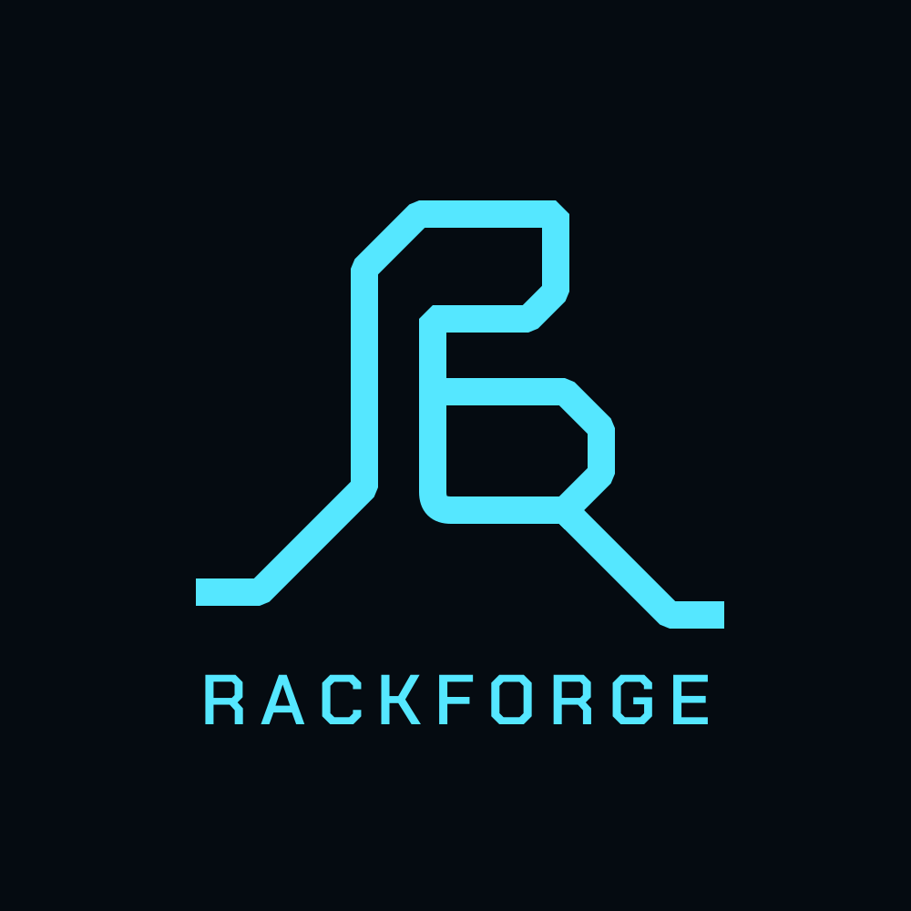

# RackForge

<p align="center">
  
</p>

<p align="center">
  <strong>Turn a computer, phone, or Raspberry Pi into a portable musical instrument.</strong>
</p>

RackForge is a cross-platform instrument host for Windows, Android, and
Raspberry Pi. Connect a MIDI controller and an audio interface, install a
portable `.rfplugin`, and play without a DAW. The same instruments and
portable plugin packages can run across all three platforms.

New installations include the RackForge Concert Grand — a physically
modelled piano developed in this repository, with no samples and a
[documented model](docs/PIANO_MODEL.md).

Open-source plugins maintained in their own repositories include:

- [RF-106](https://github.com/kalexis1994/rackforge-plugin-rf-106), a portable
  synthesizer instrument.
- [RF-Soundfonts](https://github.com/kalexis1994/rackforge-plugin-rf-soundfonts),
  a SoundFont instrument that includes the sampled YDP Grand Piano.

Both install separately as portable `.rfplugin` packages.

> RackForge `v0.1.x` is a public preview. Packages are functional but not yet
> production-signed, and additional instrument plugins are distributed
> separately.

## What you can do

- Use **PLAY** to choose an instrument and its programs.
- Use **LIVE** to build Racks, Songs, and Setlists for a performance.
- Route MIDI and audio through a visual node graph with drag, pan, zoom, and
  labels.
- Install the same portable `.rfplugin` package on Windows, Android, and
  Raspberry Pi.
- Use USB MIDI controllers and built-in or external audio interfaces.
- Reconnect MIDI hardware without restarting RackForge or leaving stuck notes.
- Control RackForge from supported hardware displays, buttons, encoders, LEDs,
  and pads through portable `.rfcontroller` packages.
- Restore the active mode, instrument, program, master volume, and pan after a
  restart.

## Try it in a browser

A published build of RackForge runs entirely inside a web page, with no
installation and no server behind it:

<https://kalexis1994.github.io/rackforge/>

It is the same host as every other platform — the same session, performance
library and portable plugin runtime, compiled to WebAssembly — playing the
bundled RackForge Demo Synth. Play it from the on-screen keyboard in Touch
Controller, or from a USB MIDI controller in browsers that support Web MIDI
(Chrome and Edge; Firefox asks for permission; Safari has none). Sound starts
after the first click or tap, which is a rule browsers apply to every page.

Install it from the browser's menu to keep it: RackForge then opens like any
other application, starts with no network at all, and keeps what you install in
it. Portable `.rfplugin` instruments can be installed straight into the page,
and they, your programs and your performances stay on the device between
visits.

What a page cannot offer, it does not pretend to: there are no audio devices to
choose between, no access PIN, and native plugin packages are refused rather
than installed and then found unplayable. Latency is the browser's, not the
operating system's — for a controller on a stage, install RackForge below.

## Choose a platform

| Platform | Best for | Audio and MIDI |
| --- | --- | --- |
| Windows x86-64 | Creating and editing performances | WASAPI, ASIO, and Windows MIDI |
| Android ARM64 | A compact touchscreen instrument | Low-latency native audio and USB MIDI |
| Raspberry Pi OS ARM64 | A dedicated headless instrument | ALSA, USB MIDI, Web control, and boot services |

Download the current packages from the
[latest RackForge release](https://github.com/kalexis1994/rackforge/releases/latest).

## Quick start

### Windows

1. Download
   [`RackForge-Windows-x86_64.exe`](https://github.com/kalexis1994/rackforge/releases/latest/download/RackForge-Windows-x86_64.exe).
2. Run the executable and choose where RackForge should store plugins,
   performances, and settings.
3. Open Settings and select the MIDI input and audio output. The Concert
   Grand is ready on the first run.
4. Install other `.rfplugin` instruments from the Plugins section as needed.

Windows builds are currently unsigned, so Windows may ask you to confirm that
you trust the application. See the
[Desktop guide](apps/rackforge-desktop/README.md) for ASIO setup, portable mode,
and troubleshooting.

### Android

1. Download
   [`RackForge-Android-arm64.apk`](https://github.com/kalexis1994/rackforge/releases/latest/download/RackForge-Android-arm64.apk).
2. Allow installation from your browser or file manager, then install the APK.
3. Connect the MIDI controller and, optionally, a class-compliant USB audio
   interface through a powered USB hub.
4. Select the devices and play the included Concert Grand, or install another
   `.rfplugin` instrument such as RF-Soundfonts.

The preview APK is ARM64 and debug-signed. The phone speaker can be used for
initial testing. See the [Android guide](apps/rackforge-android/README.md) for
USB audio, background operation, and latency details.

### Raspberry Pi in one command

Use a Raspberry Pi 4 or 5 with the 64-bit edition of Raspberry Pi OS Lite.
Run this command as the regular user that will run RackForge, **not** with
`sudo`:

```bash
bash -o pipefail -c 'curl -fsSL https://raw.githubusercontent.com/kalexis1994/rackforge/main/platforms/raspberry-pi/install-release.sh | bash'
```

The installer:

- verifies that the system uses a 64-bit ARM userspace;
- downloads the latest Raspberry Pi release over HTTPS;
- verifies the archive against the release's `SHA256SUMS.txt`;
- preserves the previous release and restores it if installation fails;
- installs the runtime, Web interface, controller host, and systemd services;
- installs the bundled Concert Grand on a new plugin store;
- enables RackForge automatically at boot and starts its control services.

When it finishes, open `http://RASPBERRY_PI_ADDRESS:8787` from another device
on the same network, then select the MIDI and audio devices. The bundled piano
does not replace or alter plugins already installed by the user.

To review the script before running it:

```bash
curl -fL https://raw.githubusercontent.com/kalexis1994/rackforge/main/platforms/raspberry-pi/install-release.sh -o install-rackforge.sh
less install-rackforge.sh
bash install-rackforge.sh
```

To install a specific release or enable the optional reversible appliance
optimizations:

```bash
RACKFORGE_VERSION=v0.1.1 bash install-rackforge.sh
RACKFORGE_OPTIMIZE=1 bash install-rackforge.sh
```

The installer detects the current user's home directory and never assumes a
fixed username. Advanced installations may set `RACKFORGE_ROOT`. See the
[Raspberry Pi guide](platforms/raspberry-pi/README.md) for manual installation,
service management, audio configuration, and diagnostics.

## From first sound to a live set

The normal workflow is the same on every platform:

1. Connect the MIDI controller and audio output.
2. Select the MIDI and audio devices in Settings.
3. Play the included Concert Grand or install another `.rfplugin`.
4. Open PLAY, select the instrument, and choose a program.
5. Open LIVE to place instruments inside Racks and organize them into Songs
   and Setlists.

RackForge keeps host configuration separate from instrument content. Plugins
own their programs and resources; LIVE owns layering, routing, splits, songs,
and the order of a performance.

## Supported control surfaces

The Arturia KeyLab Essential mk3 is the first reference controller. Its
official `.rfcontroller` package provides:

- the LITTLE display and menu navigation;
- dimmed button and pad lighting;
- master volume and pan;
- long-press return to the active instrument;
- a hardware escape chord that stops sound and returns to the main menu.

The controller package is portable across Windows, Android, and Raspberry Pi.
RackForge's core owns the musical state, while each platform adapter handles
the native MIDI and audio APIs.

## Preview status

RackForge already provides cross-platform PLAY/LIVE state, portable plugin
installation, embedded PLAY and CONFIG interfaces, plugin-private storage, a
host-owned resource explorer, program editing, MIDI hotplug recovery, session
restoration, and protection against concurrent audio engines on Windows and
Raspberry Pi.

Current preview limitations:

- Windows packages are not code-signed.
- Android packages are ARM64 and debug-signed.
- Raspberry Pi packages require a 64-bit Raspberry Pi OS userspace.
- The Concert Grand is the only bundled instrument; RF-Soundfonts and other
  `.rfplugin` instruments remain separate downloads.
- Desktop's optional HTTP server is disabled by default.
- The reliability milestone still includes package conformance gates and
  measured audio/MIDI stress tests.

## For plugin authors

RackForge plugins use portable host contracts instead of platform-specific
audio or filesystem APIs. Start with:

- [Plugin development](docs/PLUGIN_DEVELOPMENT.md)
- [Portable plugin runtime](docs/architecture/portable-plugin-runtime.md)
- [Plugin Web API](docs/WEB_PLUGIN_API.md)

Production instruments with their own assets — sample libraries, firmware —
maintain their own repositories and release pipelines. This repository carries
the conformance fixtures and the bundled Concert Grand, which is treated as
part of RackForge itself: it is built from the same commit as every host and
packaged by `rackforge-store pack-wasm`.

## For contributors

Every push to `main` runs the cross-platform GitHub Actions workflow. It
packages the bundled Concert Grand from the same commit, then builds the
Windows executable, Android APK, and Raspberry Pi ARM64 archive. Release
packages and `SHA256SUMS.txt` are published from those artifacts.

<details>
<summary><strong>Architecture and repository layout</strong></summary>

```text
MIDI controller
  • keys, pads, encoders, buttons
           │ native MIDI
           ▼
Platform MIDI + .rfcontroller package
  • discovers and reconnects hardware
  • maps controls to host intents
  • renders LITTLE, LEDs, and pads
           │
           ▼
RackForge Core
  • authoritative musical state
  • portable plugins and programs
  • Racks, Songs, and Setlists
  • routing, mixing, and audio
           │
           ▼
Platform audio
  • ALSA / WASAPI / ASIO / native Android audio
           │
           ▼
Built-in audio / USB interface
```

| Area | Responsibility |
| --- | --- |
| `crates/` | Core, APIs, SDK, and portable plugin runtime |
| `apps/` | Windows Desktop, Android, and headless/Web hosts |
| `platforms/` | Platform adapters, installation, and deployment |
| `hardware/` | Drivers and packages for supported MIDI controllers |
| `plugins/` | Minimal conformance fixtures |
| `web/` | RackForge's adaptive Web application |

The host owns authoritative engine, bank, and performance state. Controllers
send physical events and render the state they receive. A handshake rebuilds
the control surface after either side restarts.

</details>

Development helpers contain no usernames, passwords, or private keys. Start
with the platform guides and the documents below:

- [Runtime layout and process model](docs/RUNTIME.md)
- [LIVE performance and rack graphs](docs/architecture/live-performance.md)
- [Technical roadmap](ROADMAP.md)
